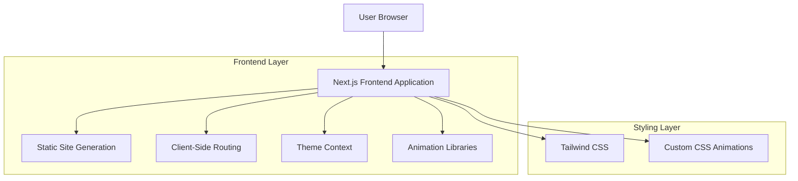
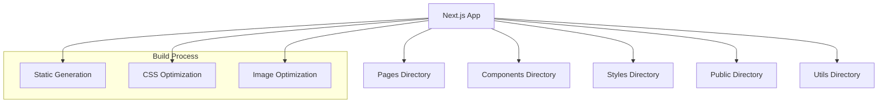
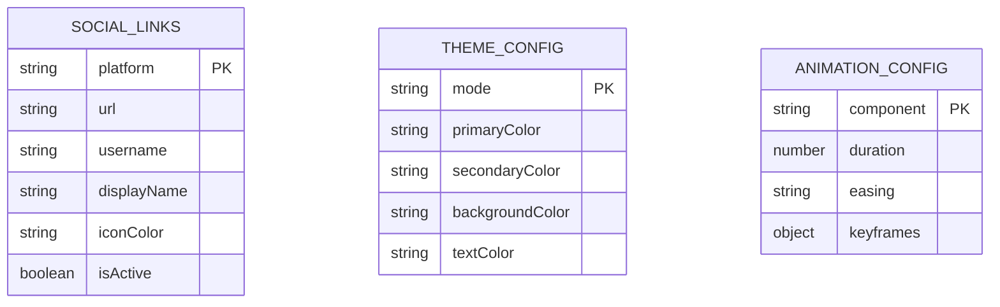

# Futuristic Personal Website - Technical Architecture Document

## 1. Architecture Design



## 2. Technology Description

* Frontend: Next.js\@14 + React\@18 + TypeScript\@5 + Tailwind CSS\@3 + Framer Motion\@10

* Build Tool: Next.js built-in bundler with Turbopack

* Deployment: Static export for hosting on any static hosting platform

## 3. Route Definitions

| Route    | Purpose                                           |
| -------- | ------------------------------------------------- |
| /        | Home page with hero section and social media grid |
| /about   | About page with personal bio and skills showcase  |
| /contact | Contact page with form and social links display   |

## 4. Component Architecture

### 4.1 Core Components

**Layout Components**

```typescript
interface LayoutProps {
  children: React.ReactNode;
  title?: string;
}

interface NavigationProps {
  currentPath: string;
}

interface ThemeToggleProps {
  theme: 'light' | 'dark';
  onToggle: () => void;
}
```

**Social Media Components**

```typescript
interface SocialLinkProps {
  platform: 'youtube' | 'tiktok' | 'instagram' | 'saweria' | 'steam' | 'email' | 'github' | 'spotify' | 'twitter' | 'discord';
  url: string;
  username?: string;
  isExternal: boolean;
}

interface SocialGridProps {
  links: SocialLinkProps[];
  layout: 'grid' | 'list';
}
```

**Animation Components**

```typescript
interface AnimatedTextProps {
  text: string;
  animation: 'typewriter' | 'fadeIn' | 'slideUp';
  delay?: number;
}

interface ParticleBackgroundProps {
  density: number;
  color: string;
  speed: number;
}
```

### 4.2 Context Providers

**Theme Context**

```typescript
interface ThemeContextType {
  theme: 'light' | 'dark';
  toggleTheme: () => void;
  systemTheme: 'light' | 'dark';
}
```

## 5. Server Architecture Diagram



## 6. Data Model

### 6.1 Data Model Definition



### 6.2 Static Data Configuration

**Social Links Configuration**

```typescript
const socialLinks: SocialLinkProps[] = [
  {
    platform: 'youtube',
    url: 'https://youtube.com/@username',
    username: '@username',
    displayName: 'YouTube',
    iconColor: '#FF0000',
    isActive: true
  },
  {
    platform: 'github',
    url: 'https://github.com/username',
    username: 'username',
    displayName: 'GitHub',
    iconColor: '#333333',
    isActive: true
  },
  {
    platform: 'email',
    url: 'mailto:business@example.com',
    username: 'business@example.com',
    displayName: 'Business Email',
    iconColor: '#EA4335',
    isActive: true
  }
  // ... other platforms
];
```

**Theme Configuration**

```typescript
const themeConfig = {
  light: {
    primary: '#00D9FF',
    secondary: '#8B5CF6',
    background: '#FFFFFF',
    surface: '#F3F4F6',
    text: '#1F2937'
  },
  dark: {
    primary: '#00D9FF',
    secondary: '#8B5CF6',
    background: '#0B1426',
    surface: '#1F2937',
    text: '#F3F4F6'
  }
};
```

**Animation Presets**

```typescript
const animationPresets = {
  fadeIn: {
    initial: { opacity: 0, y: 20 },
    animate: { opacity: 1, y: 0 },
    transition: { duration: 0.6, ease: 'easeOut' }
  },
  scaleOnHover: {
    whileHover: { scale: 1.05 },
    transition: { duration: 0.3, ease: 'easeInOut' }
  },
  glowEffect: {
    whileHover: { 
      boxShadow: '0 0 20px rgba(0, 217, 255, 0.5)' 
    },
    transition: { duration: 0.3 }
  }
};
```

