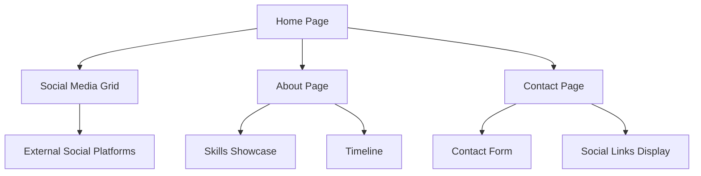

# Futuristic Personal Website - Product Requirements Document

## 1. Product Overview
A cutting-edge personal website that serves as a centralized hub for showcasing social media profiles and professional presence with a futuristic design aesthetic.
- The website solves the problem of scattered online presence by providing a unified, visually stunning platform that aggregates all social media profiles in one interactive space.
- Target users include content creators, professionals, and individuals seeking to establish a strong digital presence with modern web technologies.

## 2. Core Features

### 2.1 User Roles
This is a personal website with no user registration required - visitors can directly access all content and social media links.

### 2.2 Feature Module
Our futuristic personal website consists of the following main pages:
1. **Home page**: hero section with animated introduction, social media grid, theme toggle, navigation menu.
2. **About page**: personal bio section, skills showcase, interactive timeline.
3. **Contact page**: contact form, social links display, interactive map.

### 2.3 Page Details

| Page Name | Module Name | Feature description |
|-----------|-------------|---------------------|
| Home page | Hero Section | Display animated personal introduction with futuristic typography effects, gradient backgrounds, and smooth fade-in animations |
| Home page | Social Media Grid | Present 10 social platform links (YouTube, TikTok, Instagram, Saweria, Steam, Email, GitHub, Spotify, Twitter, Discord) in interactive card layout with hover effects |
| Home page | Theme Toggle | Switch between dark and light modes with smooth transition animations and persistent user preference |
| Home page | Navigation Menu | Responsive navigation with animated hamburger menu for mobile, smooth scroll to sections |
| About page | Personal Bio | Display personal information with animated text reveals and interactive elements |
| About page | Skills Showcase | Present technical skills with animated progress bars and interactive skill cards |
| About page | Interactive Timeline | Show career/project timeline with hover effects and expandable content |
| Contact page | Contact Form | Functional contact form with validation, animated input fields, and success/error states |
| Contact page | Social Links Display | Alternative view of social media links with detailed descriptions and direct access |
| Contact page | Interactive Elements | Animated contact cards, hover effects, and micro-interactions for enhanced user experience |

## 3. Core Process

**Visitor Flow:**
Visitors land on the homepage and are greeted with an animated hero section. They can explore social media links through the interactive grid, toggle between dark/light themes, navigate to other sections, and access contact information. All interactions feature smooth animations and responsive feedback.

## 4. User Interface Design

### 4.1 Design Style
- **Primary Colors**: Deep space blue (#0B1426), electric cyan (#00D9FF), neon purple (#8B5CF6)
- **Secondary Colors**: Dark gray (#1F2937), light gray (#F3F4F6), white (#FFFFFF)
- **Button Style**: Rounded corners (8px), gradient backgrounds, glow effects on hover, 3D depth with shadows
- **Font**: Inter for body text (16px base), Orbitron for headings (24px-48px), monospace for code elements
- **Layout Style**: Card-based design with glassmorphism effects, floating elements, grid-based responsive layout
- **Icons**: Lucide React icons with custom animations, social platform brand icons, futuristic geometric shapes

### 4.2 Page Design Overview

| Page Name | Module Name | UI Elements |
|-----------|-------------|-------------|
| Home page | Hero Section | Full-screen gradient background (#0B1426 to #1F2937), animated text with typewriter effect, floating particles, glassmorphism card overlay |
| Home page | Social Media Grid | 3x4 grid on desktop, 2x5 on tablet, 1x10 on mobile, each card with brand colors, hover scale (1.05), glow effects, smooth transitions (300ms) |
| Home page | Theme Toggle | Floating toggle button (top-right), sun/moon icons, smooth color transitions (500ms), persistent state |
| About page | Skills Showcase | Animated progress bars with gradient fills, skill cards with flip animations, interactive hover states |
| Contact page | Contact Form | Floating label inputs, gradient borders on focus, animated submit button with loading states |

### 4.3 Responsiveness
Desktop-first approach with mobile-adaptive breakpoints (sm: 640px, md: 768px, lg: 1024px, xl: 1280px). Touch interaction optimization for mobile devices with larger tap targets (minimum 44x44px) and gesture-friendly navigation.